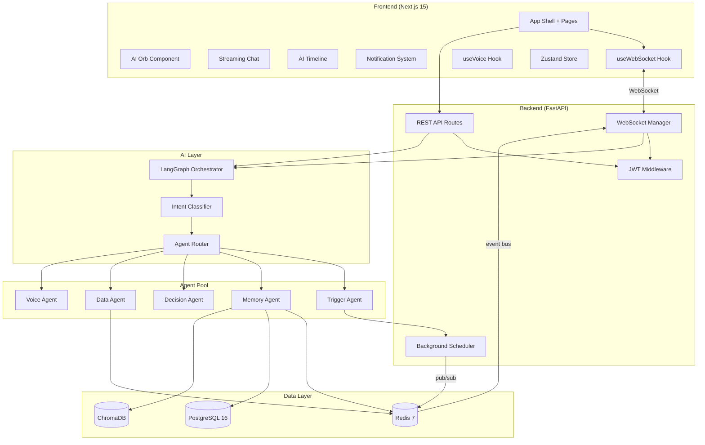

# Gamma AI Operating System — Implementation Plan

A production-grade, multi-agent AI platform with real-time streaming, voice I/O, persistent memory, and proactive notifications. Built as an upgrade from the [Kairo.AI](https://github.com/shreed27/Kairo.AI) reference architecture.

---

## User Review Required

> [!IMPORTANT]
> **API Keys Required Before Phase 1 Can Run:**
> - `OPENAI_API_KEY` — GPT-4o for chat + Whisper for STT
> - `ELEVENLABS_API_KEY` — Text-to-speech (Phase 5)
> - `OPENWEATHERMAP_API_KEY` — Weather data (Phase 4)
> - `COINGECKO_API_KEY` — Crypto data (Phase 4, free tier works)
> - `NEWS_API_KEY` — News data (Phase 4)
>
> You can set these in `.env` files; the system runs with mock/fallback data without them.

> [!WARNING]
> **Docker Desktop must be installed** for the local dev environment (Postgres, Redis, ChromaDB). If you prefer running services natively, let me know and I'll adjust.

> [!IMPORTANT]
> **Branding Decision:** The spec says "Gamma AI" but the Kairo.AI repo uses "Kairo." I'll proceed with **"Gamma AI"** throughout. Confirm if you want a different name.

---

## Open Questions

1. **Authentication scope:** The spec mentions JWT auth. Should this be a full signup/login flow with email/password, or a simpler session-based approach for the MVP? I'll default to **session-based JWT** (auto-issued, no login screen) for Phase 1.

2. **ElevenLabs voice ID:** Do you have a specific voice ID you want to use, or should I use the default "Rachel" voice?

3. **Deployment targets:** Vercel (frontend) + Railway (backend) are specified. Do you want deployment configs included from Phase 1, or only in Phase 6?

4. **Database migrations:** Should I use Alembic for Postgres schema management, or raw SQL for simplicity?

---

## Architecture Overview



---

## Project Structure

```
d:\Coding\Projects\Gamma AI\
├── frontend/                    # Next.js 15 App
│   ├── app/
│   │   ├── layout.tsx           # Root layout with providers
│   │   ├── page.tsx             # Dashboard home
│   │   ├── globals.css          # Design system + all styles
│   │   └── providers.tsx        # Client-side providers wrapper
│   ├── components/
│   │   ├── orb/
│   │   │   └── AIOrb.tsx        # Animated AI orb with state machine
│   │   ├── chat/
│   │   │   ├── ChatPanel.tsx    # Streaming chat container
│   │   │   ├── ChatMessage.tsx  # Individual message with markdown
│   │   │   └── ChatInput.tsx    # Input with voice toggle
│   │   ├── timeline/
│   │   │   └── AITimeline.tsx   # Agent event feed
│   │   ├── notifications/
│   │   │   ├── NotificationToast.tsx
│   │   │   └── NotificationPanel.tsx
│   │   ├── layout/
│   │   │   ├── Sidebar.tsx      # Navigation sidebar
│   │   │   └── Header.tsx       # Top header bar
│   │   └── ui/                  # shadcn/ui components
│   ├── hooks/
│   │   ├── useWebSocket.ts     # WS connection + reconnect
│   │   ├── useVoice.ts         # Voice capture + playback
│   │   └── useStream.ts        # Token streaming handler
│   ├── store/
│   │   ├── index.ts            # Root store exports
│   │   ├── chatStore.ts        # Chat messages + streaming state
│   │   ├── orbStore.ts         # Orb visual state machine
│   │   ├── notificationStore.ts
│   │   └── timelineStore.ts    # Agent events
│   ├── services/
│   │   ├── api.ts              # REST API client
│   │   └── ws.ts               # WebSocket message types
│   ├── types/
│   │   └── index.ts            # Shared TypeScript types
│   ├── package.json
│   ├── tsconfig.json
│   ├── tailwind.config.ts
│   ├── next.config.ts
│   └── .env.local
│
├── backend/
│   ├── main.py                  # FastAPI app, lifespan, middleware
│   ├── config.py                # Settings via Pydantic BaseSettings
│   ├── agents/
│   │   ├── __init__.py
│   │   ├── base.py              # Abstract base agent
│   │   ├── trigger_agent.py
│   │   ├── memory_agent.py
│   │   ├── decision_agent.py
│   │   ├── data_agent.py
│   │   └── voice_agent.py
│   ├── orchestrator/
│   │   ├── __init__.py
│   │   ├── graph.py             # LangGraph state machine
│   │   ├── state.py             # TypedDict state schema
│   │   └── nodes.py             # Graph node functions
│   ├── memory/
│   │   ├── __init__.py
│   │   ├── redis_store.py       # Short-term memory (TTL)
│   │   ├── postgres_store.py    # Long-term memory + profiles
│   │   └── chroma_store.py      # Semantic embeddings
│   ├── routes/
│   │   ├── __init__.py
│   │   ├── chat.py              # /api/v1/chat REST
│   │   ├── voice.py             # /api/v1/voice REST
│   │   └── memory.py            # /api/v1/memory CRUD
│   ├── websocket/
│   │   ├── __init__.py
│   │   ├── manager.py           # Connection manager
│   │   ├── handler.py           # Message dispatcher
│   │   └── events.py            # Event bus (Redis pub/sub)
│   ├── tools/
│   │   ├── __init__.py
│   │   ├── weather.py           # OpenWeatherMap wrapper
│   │   ├── crypto.py            # CoinGecko wrapper
│   │   └── news.py              # NewsAPI wrapper
│   ├── services/
│   │   ├── __init__.py
│   │   ├── llm.py               # OpenAI client wrapper
│   │   ├── tts.py               # ElevenLabs streaming TTS
│   │   └── stt.py               # Whisper transcription
│   ├── auth/
│   │   ├── __init__.py
│   │   └── jwt.py               # JWT creation + validation
│   ├── models/
│   │   ├── __init__.py
│   │   ├── schemas.py           # Pydantic v2 schemas
│   │   └── database.py          # SQLAlchemy models + engine
│   ├── requirements.txt
│   ├── .env
│   └── alembic/                 # DB migrations
│       ├── alembic.ini
│       └── versions/
│
├── infra/
│   ├── docker-compose.yml       # Local dev (PG + Redis + Chroma)
│   ├── docker-compose.prod.yml  # Production config
│   ├── Dockerfile.backend
│   ├── Dockerfile.frontend
│   └── nginx.conf
│
├── docs/
│   ├── architecture.md
│   ├── api.md
│   └── deployment.md
│
├── .gitignore
├── .env.example
└── README.md
```

---

## Phase 1 — Foundation

### Goal
Docker Compose running Postgres + Redis + ChromaDB, FastAPI app skeleton with health check, CORS, and JWT auth, Next.js app with Tailwind + shadcn/ui baseline and the initial dark-themed dashboard shell.

---

### Infrastructure

#### [NEW] [docker-compose.yml](file:///d:/Coding/Projects/Gamma%20AI/infra/docker-compose.yml)
- PostgreSQL 16 on port 5432 with `gamma_db` database
- Redis 7 on port 6379
- ChromaDB on port 8000
- Persistent volumes for all three
- Network: `gamma-network`

#### [NEW] [.env.example](file:///d:/Coding/Projects/Gamma%20AI/.env.example)
- All environment variables documented with defaults
- Includes `DATABASE_URL`, `REDIS_URL`, `CHROMA_HOST`, `JWT_SECRET`, API keys

#### [NEW] [.gitignore](file:///d:/Coding/Projects/Gamma%20AI/.gitignore)
- Standard Python + Node ignores, `.env` files, `__pycache__`, `node_modules`, `.next`

---

### Backend Foundation

#### [NEW] [main.py](file:///d:/Coding/Projects/Gamma%20AI/backend/main.py)
- FastAPI app with lifespan events (startup: connect DB/Redis/Chroma; shutdown: close pools)
- CORS middleware (configurable origins)
- Request ID injection middleware (UUID per request)
- Health check endpoint at `/health`
- Include all routers

#### [NEW] [config.py](file:///d:/Coding/Projects/Gamma%20AI/backend/config.py)
- Pydantic `BaseSettings` with env file support
- All configuration: DB URLs, API keys, JWT secret, TTL values, etc.

#### [NEW] [auth/jwt.py](file:///d:/Coding/Projects/Gamma%20AI/backend/auth/jwt.py)
- `create_token(session_id)` → JWT with expiry
- `validate_token(token)` → session payload
- Dependency injection for FastAPI routes

#### [NEW] [models/database.py](file:///d:/Coding/Projects/Gamma%20AI/backend/models/database.py)
- SQLAlchemy async engine + session factory
- Base model class
- Tables: `users`, `memory_records`, `conversations`, `agent_events`

#### [NEW] [models/schemas.py](file:///d:/Coding/Projects/Gamma%20AI/backend/models/schemas.py)
- Pydantic v2 schemas for all API I/O
- `WSMessage` envelope: `id`, `session_id`, `type`, `payload`, `ts`
- `ChatMessage`, `AgentEvent`, `Notification`, `MemoryRecord`, `UserProfile`

#### [NEW] [requirements.txt](file:///d:/Coding/Projects/Gamma%20AI/backend/requirements.txt)
```
fastapi[standard]==0.115.*
uvicorn[standard]==0.34.*
pydantic==2.*
pydantic-settings==2.*
sqlalchemy[asyncio]==2.*
asyncpg==0.30.*
redis[hiredis]==5.*
chromadb-client==0.6.*
langchain==0.3.*
langchain-openai==0.3.*
langgraph==0.4.*
openai==1.*
httpx==0.28.*
python-jose[cryptography]==3.*
structlog==24.*
apscheduler==3.*
python-multipart==0.0.*
elevenlabs==1.*
```

---

### Frontend Foundation

#### [NEW] Next.js App (initialized via `npx`)
- Next.js 15 with App Router, TypeScript strict mode
- Tailwind CSS 4
- Install: `framer-motion`, `zustand`, `react-markdown`, `lucide-react`
- shadcn/ui init with dark theme

#### [NEW] [globals.css](file:///d:/Coding/Projects/Gamma%20AI/frontend/app/globals.css)
- Design system tokens (CSS custom properties):
  - Dark background: `#05050A`, panel: `#0C0C14`
  - Purple/pink accent gradient: `#8b5cf6 → #d946ef`
  - Glass morphism: `backdrop-blur`, translucent backgrounds
- Typography: Inter font from Google Fonts
- Custom scrollbar styling
- Dashboard layout: sidebar + main + right panel
- Animation keyframes: pulse, shimmer, rotate, wave

#### [NEW] [layout.tsx](file:///d:/Coding/Projects/Gamma%20AI/frontend/app/layout.tsx)
- Root layout with Inter font, meta tags, SEO
- `Providers` wrapper for Zustand

#### [NEW] [page.tsx](file:///d:/Coding/Projects/Gamma%20AI/frontend/app/page.tsx)
- Dashboard shell with sidebar navigation
- Header with date/weather display
- Central area: AI Orb placeholder + chat area
- Right panel: timeline + notifications placeholder

#### [NEW] [Sidebar.tsx](file:///d:/Coding/Projects/Gamma%20AI/frontend/components/layout/Sidebar.tsx)
- Navigation: Home, Chat, Memory, Timeline, Notifications, Settings
- Active state highlighting with purple accent
- Animated logo with conic gradient

#### [NEW] [Header.tsx](file:///d:/Coding/Projects/Gamma%20AI/frontend/components/layout/Header.tsx)
- Date/time display
- Connection status indicator
- Notification bell with badge count

---

## Phase 2 — Real-time Channel

### Goal
Bidirectional WebSocket communication with shared message envelope, heartbeat, ACK protocol, and automatic reconnection.

---

### Backend WebSocket

#### [NEW] [websocket/manager.py](file:///d:/Coding/Projects/Gamma%20AI/backend/websocket/manager.py)
- `ConnectionManager` class:
  - `connect(websocket, session_id)` → register + JWT validate
  - `disconnect(session_id)` → cleanup
  - `send_to_session(session_id, message)` → typed envelope
  - `broadcast(message)` → all connected clients
  - Heartbeat task: ping every 30s, disconnect stale connections after 90s
  - Connection pool with async locks for thread safety

#### [NEW] [websocket/handler.py](file:///d:/Coding/Projects/Gamma%20AI/backend/websocket/handler.py)
- Message dispatcher: parse incoming `WSMessage` → route to handlers
- Type routing: `chat_message` → orchestrator, `voice_data` → voice pipeline, `interrupt` → cancel in-flight, `ack` → confirm delivery

#### [NEW] [websocket/events.py](file:///d:/Coding/Projects/Gamma%20AI/backend/websocket/events.py)
- Redis pub/sub event bus
- `publish_event(channel, event)` → background agents emit events
- `subscribe(channel, callback)` → WS manager listens and forwards to clients
- Channels: `agent_events`, `notifications`, `memory_updates`

#### [MODIFY] [main.py](file:///d:/Coding/Projects/Gamma%20AI/backend/main.py)
- Add WebSocket endpoint: `@app.websocket("/ws/{session_id}")`
- Wire up connection manager + handler

---

### Frontend WebSocket

#### [NEW] [hooks/useWebSocket.ts](file:///d:/Coding/Projects/Gamma%20AI/frontend/hooks/useWebSocket.ts)
- Custom hook with:
  - Auto-connect on mount with session ID
  - Exponential backoff reconnect (1s → 2s → 4s → 8s → 16s max)
  - Heartbeat response (pong)
  - Message queue for offline buffering
  - `sendMessage(type, payload)` → construct WSMessage envelope
  - `onMessage(type, handler)` → typed event listeners
  - Connection state exposed: `connecting`, `connected`, `reconnecting`, `disconnected`
  - ACK tracking with timeout

#### [NEW] [services/ws.ts](file:///d:/Coding/Projects/Gamma%20AI/frontend/services/ws.ts)
- TypeScript types for all WS message types:
  ```typescript
  type WSMessageType = "chat_token" | "chat_done" | "agent_event" | 
    "notification" | "error" | "ack" | "heartbeat" | "chat_message" | 
    "voice_data" | "interrupt";
  ```
- Message factory functions
- UUID generator for message IDs

#### [NEW] [types/index.ts](file:///d:/Coding/Projects/Gamma%20AI/frontend/types/index.ts)
- All shared types: `WSMessage`, `ChatMessage`, `AgentEvent`, `Notification`, `OrbState`, `MemoryRecord`

---

## Phase 3 — Core AI Loop

### Goal
LangGraph orchestrator wired to intent classification, memory retrieval, agent routing, and streaming response. Chat UI with Orb state integration.

---

### LangGraph Orchestrator

#### [NEW] [orchestrator/state.py](file:///d:/Coding/Projects/Gamma%20AI/backend/orchestrator/state.py)
- `GammaState(TypedDict)`:
  ```python
  class GammaState(TypedDict):
      session_id: str
      user_input: str
      intent: str                    # classified intent
      memory_context: dict           # merged memory from all tiers
      agent_results: dict            # results from dispatched agents
      response_tokens: list[str]     # streaming tokens
      conversation_history: list[dict]
      error: Optional[str]
      metadata: dict
  ```

#### [NEW] [orchestrator/graph.py](file:///d:/Coding/Projects/Gamma%20AI/backend/orchestrator/graph.py)
- LangGraph `StateGraph` definition:
  ```
  START → classify_intent → retrieve_memory → route_agent → generate_response → END
                                                  ↓
                                          [conditional edges]
                                    weather → data_agent_node
                                    crypto → data_agent_node  
                                    memory → memory_agent_node
                                    decision → decision_agent_node
                                    general → generate_response
  ```
- Streaming output via `astream_events`
- Error handling wrapper on every node (fallback response on failure)

#### [NEW] [orchestrator/nodes.py](file:///d:/Coding/Projects/Gamma%20AI/backend/orchestrator/nodes.py)
- `classify_intent(state)` — GPT-4o with structured output to classify user intent into: `weather`, `crypto`, `news`, `memory_query`, `memory_store`, `decision`, `general`, `voice_command`
- `retrieve_memory(state)` — Fan out to Redis → Chroma → Postgres, merge context
- `route_agent(state)` — Conditional routing based on classified intent
- `generate_response(state)` — GPT-4o streaming with full context injection
- Each node wrapped in try/except with structured error logging

---

### Memory System

#### [NEW] [memory/redis_store.py](file:///d:/Coding/Projects/Gamma%20AI/backend/memory/redis_store.py)
- `RedisMemory` class:
  - `store_turn(session_id, role, content)` → Redis list with 2h TTL
  - `get_recent_turns(session_id, n=10)` → last N conversation turns
  - `cache_set(key, value, ttl)` / `cache_get(key)` → general cache

#### [NEW] [memory/postgres_store.py](file:///d:/Coding/Projects/Gamma%20AI/backend/memory/postgres_store.py)
- `PostgresMemory` class:
  - `get_user_profile(user_id)` → preferences, history, metadata
  - `update_preference(user_id, key, value)` → upsert preference
  - `store_memory_record(user_id, content, type)` → long-term memory
  - `get_memory_records(user_id, type, limit)` → retrieve records

#### [NEW] [memory/chroma_store.py](file:///d:/Coding/Projects/Gamma%20AI/backend/memory/chroma_store.py)
- `ChromaMemory` class:
  - `embed_and_store(text, metadata)` → embed via OpenAI, upsert to collection
  - `semantic_search(query, top_k=5)` → cosine similarity retrieval
  - Collection per user for isolation

---

### Memory Agent

#### [NEW] [agents/base.py](file:///d:/Coding/Projects/Gamma%20AI/backend/agents/base.py)
- Abstract `BaseAgent` class:
  - `async execute(state: GammaState) -> dict` — abstract method
  - `name: str` property
  - Built-in error handling with fallback response
  - Structured logging for every invocation

#### [NEW] [agents/memory_agent.py](file:///d:/Coding/Projects/Gamma%20AI/backend/agents/memory_agent.py)
- Implements `BaseAgent`
- On every user message:
  1. Store turn in Redis (short-term)
  2. Embed + upsert in ChromaDB (semantic)
  3. Detect preferences via GPT-4o structured output → update Postgres if new
- On retrieval:
  1. Redis: last 10 turns
  2. Chroma: top-5 similar memories
  3. Postgres: user profile + preferences
  4. Merge and return as context dict

---

### LLM Service

#### [NEW] [services/llm.py](file:///d:/Coding/Projects/Gamma%20AI/backend/services/llm.py)
- `LLMService` class wrapping OpenAI AsyncClient
- `stream_chat(messages, system_prompt)` → async generator of tokens
- `structured_output(messages, schema)` → Pydantic model output
- `embed(text)` → embedding vector
- Token counting and rate limit handling

---

### Frontend Chat UI

#### [NEW] [components/orb/AIOrb.tsx](file:///d:/Coding/Projects/Gamma%20AI/frontend/components/orb/AIOrb.tsx)
- SVG/Canvas animated orb using Framer Motion `variants` API
- States driven by `orbStore`:
  - `idle` — slow pulse, soft glow, breathing animation
  - `listening` — fast ring expansion, blue accent, microphone active
  - `thinking` — rotation + shimmer, purple gradient sweep
  - `speaking` — waveform visualization, green accent
  - `error` — red flash, shake animation
- Smooth transitions between states via Framer Motion `AnimatePresence`
- Click handler toggles voice input

#### [NEW] [store/orbStore.ts](file:///d:/Coding/Projects/Gamma%20AI/frontend/store/orbStore.ts)
- Zustand store:
  - `state: 'idle' | 'listening' | 'thinking' | 'speaking' | 'error'`
  - `setState(newState)` with transition validation
  - Updated by WebSocket events (`agent_event` type)

#### [NEW] [components/chat/ChatPanel.tsx](file:///d:/Coding/Projects/Gamma%20AI/frontend/components/chat/ChatPanel.tsx)
- Scrollable message list with auto-scroll
- Scroll-lock override (user scrolls up → stop auto-scroll)
- Loading indicator during AI thinking
- Connected to `chatStore`

#### [NEW] [components/chat/ChatMessage.tsx](file:///d:/Coding/Projects/Gamma%20AI/frontend/components/chat/ChatMessage.tsx)
- Renders user/assistant messages
- Markdown rendering via `react-markdown` with syntax highlighting
- Token-by-token rendering for streaming (characters append to last message)
- Timestamps, copy button, role avatar

#### [NEW] [components/chat/ChatInput.tsx](file:///d:/Coding/Projects/Gamma%20AI/frontend/components/chat/ChatInput.tsx)
- Text input with send button
- Voice toggle button (switches to voice mode)
- Shift+Enter for multiline
- Disabled state during AI response

#### [NEW] [store/chatStore.ts](file:///d:/Coding/Projects/Gamma%20AI/frontend/store/chatStore.ts)
- Messages array with `id`, `role`, `content`, `timestamp`, `isStreaming`
- `addMessage(msg)`, `appendToken(id, token)`, `completeMessage(id)`
- `isLoading` state

#### [NEW] [hooks/useStream.ts](file:///d:/Coding/Projects/Gamma%20AI/frontend/hooks/useStream.ts)
- Handles `chat_token` WS messages → appends to current streaming message
- Handles `chat_done` → marks message complete
- Handles `error` → surfaces to UI

---

## Phase 4 — Agent Layer

### Goal
Data Agent fetching live external data, Trigger Agent with background scheduler for proactive notifications, Decision Agent with structured reasoning.

---

### Data Agent

#### [NEW] [agents/data_agent.py](file:///d:/Coding/Projects/Gamma%20AI/backend/agents/data_agent.py)
- Async fanout to external APIs via `httpx`
- Implements `BaseAgent.execute()`:
  - Reads intent to determine which APIs to call
  - Parallel `asyncio.gather` for multiple data sources
  - Results cached in Redis with appropriate TTLs (weather: 30min, crypto: 2min, news: 15min)
  - Returns typed Pydantic schemas

#### [NEW] [tools/weather.py](file:///d:/Coding/Projects/Gamma%20AI/backend/tools/weather.py)
- `get_weather(city)` → `WeatherData` schema
- `get_forecast(city, days)` → list of `WeatherData`
- OpenWeatherMap API with Redis cache

#### [NEW] [tools/crypto.py](file:///d:/Coding/Projects/Gamma%20AI/backend/tools/crypto.py)
- `get_price(coin_id)` → `CryptoPrice` schema
- `get_market_data(coin_ids)` → list with 24h change, volume
- CoinGecko free API with rate limiting

#### [NEW] [tools/news.py](file:///d:/Coding/Projects/Gamma%20AI/backend/tools/news.py)
- `get_headlines(category, country)` → list of `NewsArticle`
- `search_news(query)` → list of `NewsArticle`
- NewsAPI with Redis cache

---

### Trigger Agent

#### [NEW] [agents/trigger_agent.py](file:///d:/Coding/Projects/Gamma%20AI/backend/agents/trigger_agent.py)
- Monitors external signals on a schedule:
  - **Crypto volatility:** >5% price swing in 1h → notification
  - **Weather alerts:** Rain/storm forecast → umbrella reminder
  - **Time-based rules:** Configurable per-user (e.g., Friday 7pm → food suggestion)
- Emits structured notification events to Redis pub/sub
- Events flow: Trigger → Redis → WS Manager → Client

#### [MODIFY] [main.py](file:///d:/Coding/Projects/Gamma%20AI/backend/main.py)
- Add APScheduler background task runner
- Register Trigger Agent jobs:
  - Crypto check: every 5 minutes
  - Weather check: every 30 minutes
  - Time-based rules: every minute (checks against user rules)

---

### Decision Agent

#### [NEW] [agents/decision_agent.py](file:///d:/Coding/Projects/Gamma%20AI/backend/agents/decision_agent.py)
- Multi-step reasoning using GPT-4o with structured output:
  ```python
  class Decision(BaseModel):
      recommendation: str
      rationale: str
      confidence: float  # 0-1
      alternatives: list[str]
      follow_up_suggestions: list[str]
  ```
- Injects memory context + live data for informed decisions
- Returns structured `Decision` schema, never raw text

---

## Phase 5 — Voice

### Goal
Full voice pipeline: audio capture → Whisper STT → LangGraph → ElevenLabs TTS → streaming audio playback, with barge-in support.

---

### Voice Agent (Backend)

#### [NEW] [agents/voice_agent.py](file:///d:/Coding/Projects/Gamma%20AI/backend/agents/voice_agent.py)
- Pipeline coordinator:
  1. Receive audio chunks from WebSocket
  2. Buffer and send to Whisper API
  3. Inject transcript as user message into LangGraph
  4. Stream response text tokens to ElevenLabs in parallel
  5. Stream audio chunks back via WebSocket
- Barge-in: listens for `interrupt` message → cancels in-flight TTS

#### [NEW] [services/stt.py](file:///d:/Coding/Projects/Gamma%20AI/backend/services/stt.py)
- `transcribe(audio_bytes, format="webm")` → text
- OpenAI Whisper API with language detection
- Chunked upload for large files

#### [NEW] [services/tts.py](file:///d:/Coding/Projects/Gamma%20AI/backend/services/tts.py)
- `stream_tts(text)` → async generator of audio chunks (bytes)
- ElevenLabs streaming API with configurable voice
- Sentence-level chunking for natural pauses
- Cancellation support via `asyncio.Event`

#### [MODIFY] [websocket/handler.py](file:///d:/Coding/Projects/Gamma%20AI/backend/websocket/handler.py)
- Add `voice_data` message type handling → route to Voice Agent
- Add `interrupt` message type → cancel in-flight TTS + reset pipeline

#### [NEW] [routes/voice.py](file:///d:/Coding/Projects/Gamma%20AI/backend/routes/voice.py)
- `POST /api/v1/voice` → REST fallback for non-WS voice
- Accept audio file upload → transcribe → orchestrate → return text response

---

### Voice Client (Frontend)

#### [NEW] [hooks/useVoice.ts](file:///d:/Coding/Projects/Gamma%20AI/frontend/hooks/useVoice.ts)
- `MediaRecorder` API for audio capture (opus/webm)
- Stream audio chunks over WebSocket during recording
- Receive audio chunks back → play via `Web Audio API`
- Jitter buffer for smooth playback
- Energy threshold detection for barge-in:
  - Monitor microphone input during TTS playback
  - If energy exceeds threshold → send `interrupt` message
- States: `idle`, `recording`, `processing`, `playing`

---

## Phase 6 — Polish + Deployment

### Goal
AI Timeline, Notification system, production Docker configs, deployment, observability, documentation.

---

### AI Timeline

#### [NEW] [components/timeline/AITimeline.tsx](file:///d:/Coding/Projects/Gamma%20AI/frontend/components/timeline/AITimeline.tsx)
- Chronological feed of agent events
- Each event: type badge (color-coded), timestamp, title, expandable detail
- Event types: `decision`, `memory_write`, `notification`, `tool_call`, `error`
- Connected to `timelineStore` + WebSocket `agent_event` messages
- Animated entry with Framer Motion `staggerChildren`

#### [NEW] [store/timelineStore.ts](file:///d:/Coding/Projects/Gamma%20AI/frontend/store/timelineStore.ts)
- Events array with filtering by type
- `addEvent(event)`, `clearEvents()`
- Max 100 events retained in memory

---

### Notification System

#### [NEW] [components/notifications/NotificationToast.tsx](file:///d:/Coding/Projects/Gamma%20AI/frontend/components/notifications/NotificationToast.tsx)
- Toast notifications with auto-dismiss (5s default, high-priority: 10s)
- Slide-in from top-right with Framer Motion
- Priority-based styling: info (blue), warning (amber), critical (red)
- Action button for actionable notifications

#### [NEW] [components/notifications/NotificationPanel.tsx](file:///d:/Coding/Projects/Gamma%20AI/frontend/components/notifications/NotificationPanel.tsx)
- Persistent panel (slide-out drawer)
- All notifications with read/unread state
- Filter by type, clear all
- High-priority notifications also trigger Orb state change

#### [NEW] [store/notificationStore.ts](file:///d:/Coding/Projects/Gamma%20AI/frontend/store/notificationStore.ts)
- Notifications array with `type`, `priority`, `title`, `body`, `action_url`, `read`
- `addNotification()`, `markRead(id)`, `clearAll()`
- Unread count computed

---

### Production Deployment

#### [NEW] [Dockerfile.backend](file:///d:/Coding/Projects/Gamma%20AI/infra/Dockerfile.backend)
- Multi-stage build: slim Python 3.11
- Non-root user, health check, proper signal handling

#### [NEW] [Dockerfile.frontend](file:///d:/Coding/Projects/Gamma%20AI/infra/Dockerfile.frontend)
- Next.js standalone build output
- Multi-stage: build → production with minimal image

#### [NEW] [docker-compose.prod.yml](file:///d:/Coding/Projects/Gamma%20AI/infra/docker-compose.prod.yml)
- All services + backend + frontend containers
- Nginx reverse proxy with SSL termination
- Resource limits, restart policies

#### [NEW] [nginx.conf](file:///d:/Coding/Projects/Gamma%20AI/infra/nginx.conf)
- WebSocket upgrade headers
- Proxy pass to backend + frontend
- Gzip compression, security headers

---

### Observability

#### [MODIFY] [main.py](file:///d:/Coding/Projects/Gamma%20AI/backend/main.py)
- Structured JSON logging via `structlog`
- OpenTelemetry traces on all agent invocations
- Prometheus metrics endpoint at `/metrics`
- Request duration, active connections, agent invocation counts

---

### Documentation

#### [NEW] [README.md](file:///d:/Coding/Projects/Gamma%20AI/README.md)
- Project overview with architecture diagram
- Quick start guide (Docker Compose)
- Environment variable reference
- Development workflow

#### [NEW] [docs/architecture.md](file:///d:/Coding/Projects/Gamma%20AI/docs/architecture.md)
- System architecture deep dive
- Agent specifications
- Memory system design
- Real-time communication protocol

#### [NEW] [docs/api.md](file:///d:/Coding/Projects/Gamma%20AI/docs/api.md)
- REST API reference (OpenAPI)
- WebSocket protocol spec with all message types
- Authentication flow

#### [NEW] [docs/deployment.md](file:///d:/Coding/Projects/Gamma%20AI/docs/deployment.md)
- Local development setup
- Production deployment (Vercel + Railway)
- Environment configuration
- Monitoring + troubleshooting

---

## Verification Plan

### Automated Tests
For each phase, I will:
1. **Backend:** Run `ruff check backend/` for linting — zero errors required
2. **Frontend:** Run `npx tsc --noEmit` — zero errors required
3. **Docker:** Run `docker compose up` and verify all containers healthy
4. **WebSocket:** Test connection, heartbeat, message round-trip
5. **Chat:** Send a message and verify streaming response
6. **Voice:** Test audio capture → transcription → response → TTS playback
7. **Memory:** Verify data persists across page reloads
8. **Notifications:** Verify proactive notification delivery

### Manual Verification
- Full user flow: open app → chat → get streaming response → see Orb state changes
- Voice conversation round-trip under 2 seconds
- At least one proactive notification fires without user prompt
- Memory influences subsequent responses correctly
- All agent errors surface as typed events in UI
- Docker Compose produces fully working local environment

---

## Delivery Sequence

| Phase | Description | Key Deliverables | Est. Files |
|-------|-------------|------------------|------------|
| 1 | Foundation | Docker, FastAPI skeleton, Next.js shell | ~20 |
| 2 | Real-time Channel | WebSocket manager, useWebSocket hook, message protocol | ~8 |
| 3 | Core AI Loop | LangGraph, Memory system, Chat UI, AI Orb | ~18 |
| 4 | Agent Layer | Data/Trigger/Decision agents, external APIs | ~8 |
| 5 | Voice | Whisper STT, ElevenLabs TTS, voice hooks | ~6 |
| 6 | Polish + Deploy | Timeline, Notifications, Docker prod, docs | ~15 |
| **Total** | | | **~75 files** |
